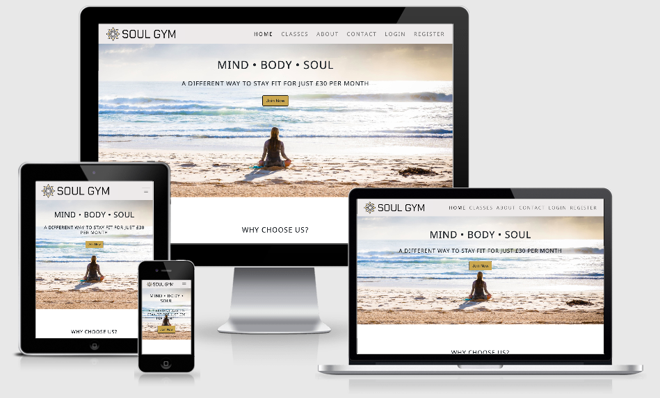

# Milestone Project 1 - Soul Gym
View live project <a href="https://gregory4321.github.io/milestone-project-1/">here
***
## Table of Contents:
* [What does it do and what does it need to fulfill?](#what-does-it-do-and-what-does-it-need-to-fulfill)
* [User Experience](#user-experience)
   * [User Stories](#user-stories)
   * [Design](#design)
       * [1. Colour Scheme](#1-color-scheme)
       * [2. Font](#2-font)
       * [3. Logo](#3-logo)
       * [4. Geometry](#4-geometry)
       * [5. Wireframes](#5-wireframes)
* [Technologies Used](#technologies-used)
* [Features](#features)
   * [Existing Features](#future-features)
   * [Future Features](#removed-features)
* [Testing](#testing)
* [Deployment](#deployment)
    * [Hosting on Github Pages](#hosting-on-github-pages)
    * [Running Project Locally](#running-project-locally)
* [Credits](#credits)
    * [Content](#content)
    * [Code](#code)
    * [Media](#media)
* [Acknowledgements](#acknowledgements)
* [Special Thanks](#special-thanks)
* [Disclaimer](#disclaimer)
***

## 

### Soul Gym Logo

***
## **What does it do and what does it need to fulfill?**
This is my first milestone project where I have designed, created and built a mobile-first responsive website for a gym. My goals with this website are to share the unique perspective on fitness that this gym offers; to persuade prospective members to sign up; and to give existing members an online space to book classes and enforce a sense of community. 

I have taken my knowledge learnt from the beginning three modules of the Full Stack Web Developer course, (HTML, CSS Fundamentals, and User Centric Frontend Development Modules) to provide a clear, functioning and responsive website that demonstrates a proficient use of HTML5 and CSS3. The Bootstrap Framework was used along side these programming languages to help give the site a clear strucutre and ensure the site is as responsive as possible for use across various screen sizes, including desktop, tablet and mobile.

## **User Experience**

#### User Stories:
* First-Time Visitor Goals
    * As a first-time visitor, I want to be able to navigate through the entire site, comfortably and securely.
    * As a first-time visitor, I want to be able to easily message the gym with any initial queires that I may have.
    * As a first-time visitor, I want to learn more about the gym's ethos and what is available.
    

* Prospective Gym Member
    * As a prospective gym member, I want to know how much membership costs.
    * As a prospective gym member, I want to be able to book a tour.
    * As a prospective gym member, I want to see what classes and facilities the gym offers.
    * As a prospective gym member, I want to feel comfortable with and informed on the gym's ethos and know that it is right for me.
    * As a prospective gym member, I want to be able to contact and locate the gym.
    * As a prospective gym member, I want to be able to sign up to the gym should it meet my needs and wants.

 
* As a member of Soul Gym
    * As a member of Soul Gym, I want to be able to login to my account.
    * As a member of Soul Gym, I want to be able to book a class.
    * As a member of Soul Gym, I want to be kept up to date on any new facilities and initiatives the gym is working towards.
    * As a member of Soul Gym, I want to be able to easily access the weekly class timetable, so I can plan my visits.
    * As a member of Soul Gym, I want to be able to easily submit any questions, feedback or complaints.

[Back to Top](#table-of-contents)

#### Design
##### 1. Colour Scheme

I chose soothing, neutral colours to make the website inviting and help visitors feel calm when visiting the site. The muted tones give the page a serene look and feel. This was important to me as my aim was to create an online space that promotes mental as well as physical health and wellbeing. 

Colours I used are:

* ECEAEA - Platinum - Primary Colour
* C4A55F - Light French Beige - Secondary Colour
* 827081 - Old Lavender - Accent Colour
* 000000 - Black - Text Colour

The primary colour, Platinum (ECEAEA), was used throughout the pages to give the whole site consistency. I used it for the navbar and footer, as well as the background colour for my forms and individual cards on both the 'Classses' and 'About' pages. 
I originally used the secondary colour, Light French Beige (C4A55F), within the symbol in my logo. When I included this in the page, I found it provided a nice contrast with the primary colour. This led me to use it throughout the site for social icons, buttons, table hover and the names of the people in the quotes section. 
I knew I needed another accent colour to make the site more engaging. I went for Old Lavender (827081) which both contrasted with the primary colour and complemented the secondary colour. I used it to implement user feedback. When a user hovers over the social icons and clicks they go from Light French Beige to Old Lavender. To cement the accent colour's presence on the site and make the scheme feel more cohesive, I also used it for block dividers between content and as borders for the forms and cards. I feel this really helped to make the content within the cards stand out. 
I toyed with the idea to have a fourth colour as a main background across the pages, but I found that it made them look too busy and muddied the design. The main goal of this gym is to change the way people see fitness with an emphasis on yoga, meditation and mindfulness. With this in mind, I thought it was better to keep a degree of white space throughout the site. It made it easier on the eye and promoted the minimalist, serene look and feel I was aiming for. 
I opted for Black (00000) as my text colour to make sure all the words clear and easy to read. The only pieces of text I did not implement this colour on were the names of people I quoted on the home page (detailed above) as I felt these would benefit from a bit of contrast.

##### 2. Font

I decided to use two fonts throught my site. I included these fonts by inserting an _import_ link of Google Fonts API into the top of my style.css. 
The font I chose for the body text on the pages was 'Roboto', with a fall back of 'Sans-serif' should the site not load the import correctly. I found the 'Roboto' font was clear and easy to read and fed into the simple, minimal look and feel I was trying to achieve with the site. 
The second font I used was 'Noto Sans', again with the fallback of 'Sans-serif'. I used this for anything I wanted to stand out a little more. This included the navbar, footer, headlines and sub-headings. I wanted a font that complemented the body text without being wildly different from it. This would have made the page too busy and drawn attention away from the beautiful, peace-invoking imagery it was sitting alongside. Simplicity was key and the combination of Roboto and Noto Sans helped me achieve that objective.

##### 3. Logo

The logo was created using an online design tool called Canva. I created a custom canvas to fit my required dimensions and set the background to the primary colour so it blended with the navbar.
When it came to designing the logo I wanted a symbol that matched the look and feel of the site. I selectedthe mandala from Canva's selection of free symbols and played with the colours until I found a combination I liked. This is where I found what would become the secondary colour of my entire website.
I chose the font 'Chakra Petch' for the logo because it felt modern and stood out with its angular edges without being too bold. It suited the site's branding and complemented all my other design choices well. 

##### 4. Composition

There is a clear structure throughout the site. Each of the main pages was has a hero image at the top to engage the user with text overtop of it. I also implemented content hinting where possible to encourage scrolling and more user interaction. 
To help me keep the design neat and consistent, I used the 'Rule of Thirds'. This also helps to draw the viewer's eye into the composition, rather than just glancing at the center, so I wanted to make sure I implemented it in my design. You can find evidence of this in the footer, but it's displayed most clearly on the 'Classes' page with the cards and the 'Home' page with the quotes. 
I was going to display the 'About' page in this way, but upon consideration I decided to place the cards down the centre. Because of the volume of text in these cards, they made the page too cluttered when they were in a row of three. Displaying them crentally down the page kept a good amount of white space. I also think that having to scroll down through the cards made it feel like the story was unfolding which I thought was a nice touch.

##### 5. Wireframes

Wireframes for this project were created using Balsamiq. I initially sketched rough ideas down on paper and then further constructed them on the computer using Balsamiq to create a more detailed mockup. The final pages I ended up with on the website did not vary too much from the wireframes I made during the planning stages. Find the links to these wireframes below:

* [Home Page Wireframe](https://github.com/Gregory4321/milestone-project-1/blob/master/assets/images/wire-home.jpg)

* [Classes Page Wireframe](https://github.com/Gregory4321/milestone-project-1/blob/master/assets/images/wire-class.jpg)

* [About Page Wireframe](https://github.com/Gregory4321/milestone-project-1/blob/master/assets/images/wire-about.jpg)

* [Contact Page Wireframe](https://github.com/Gregory4321/milestone-project-1/blob/master/assets/images/wire-contact.jpg)

[Back to Top](#table-of-contents)

 ## **Technologies Used**

 #### Languages

 * [HTML5](https://en.wikipedia.org/wiki/HTML5) - Language used to create the structure of the pages.

 * [CSS3](https://en.wikipedia.org/wiki/Cascading_Style_Sheets) - Language used to add styling across all pages.

#### Libraries, Frameworks and Editors

* [Bootstrap 4.5.0](https://getbootstrap.com/) - used to creat basic HTML layout and structure and using Bootstrap's CSS Framwework. The resposnsive grid system was utilised well.

* [Google Fonts](https://fonts.google.com/) - was used to import the 'Roboto' and 'Noto Sans' fonts, that were used across all pages.

* [Font Awesome](https://fontawesome.com/) - was used for the social icons and the calender link found in the footer.

* [jQuery](https://jquery.com/) - was used in conjunction with Bootstrap to create the navbar collapse element.

* [Git](https://git-scm.com/) - used for version control by making use of the Gitpod terminal to add, commit and push to Github.

* [Github](https://github.com) - used to host the project's repository and store the code, as well as host the website on Github pages.

* [Unsplash](https://unsplash.com/) - used to find images for use across the site.

* [Pexels](https://www.pexels.com/) - used to find images for use across the site.

#### Tools

* [Google](https://www.google.co.uk/) - was used for researching various techniques, styles and information.

* [Google Chrome DevTools](https://developers.google.com/web/tools/chrome-devtools) - used for testing and debugging.

* [Google Maps](https://www.google.co.uk/maps) - used to embed a map to show the whereabouts of the gym.

* [Balsamiq](https://balsamiq.com/) - used for creating the wireframes in the design stage.

* [Coolors](https://coolors.co/) - used to find and compare colours that complimented one another.

* [Canva](https://www.canva.com/) - was used to design and create the logo, and also to resize images to specific dimensions.

* [Picresize](https://picresize.com/) - was also used to resize images for less specific wants, such as 25% or 50% smaller.

* [Am I Responsive](http://ami.responsivedesign.is/) - used for showing the responsiveness of the site across different screen sizes and providing the image at the top of this document.

* [Free Online HTML Formatter](https://www.freeformatter.com/html-formatter.html#ad-output) - used to format the HTML code in a neater and more organised fashion.

## **Features**

#### Existing Features

* Navbar - Featured across all pages, site visitors can use the links on the right to navigate between all pages on the website. These links also collapse down into a hamburger icon at smaller screen sizes. The logo, found on the left, can be clicked on all pages to take users back to the home page.

* Footer - Also featured across all pages, the footer is used for imforming the user that they can book a tour and provides a link in the form of an icon to the contact page where said tour can be scheduled. This is found on the left third of the footeer. On the right third of the footer, users will find social icons linking to the coresponding social media pages.

* Hero images -  These can be found across the three main pages (Home, Classes and About), and provide a visual reference to the page the user is on. There is also text displayed on top of the image, relating to the page, as well as a call to action button linking to desired pages - e.g.: Register page from the Home and About pages, and Contact page from the Classes page. These interavtive features encourage the user to register with the gym and book a class. There is also a hero image used on the homepage at the bottom to advertise that there will soon be a spa available at the gym. This is to ensure the user that the gym is still an expanding facility, forever moving forward.

* Testimonials - The 'Why Choose Us' section was created to showcase what other customers thought of the gym and what it has to offer.

* Classes Page - This page showcases what classes are available, informing the user what to expect from each class. It also contains a timetable that the user can use to decide what classes they can take on a particular day and time.

* About Page - This page was created to help the user understand how the gym came about. The gym promotes mental wellbeing and mindfulness which are incredibly personal facets of fitness. I wanted to appeal to readers by giving the gym a personal touch and providing the reader with an origin story that shows how the gym came about. 
I felt this added a personal touch and acknowledging the cultural origins of Soul Gym's practice gave the whole brand and platform more integrity.
I've also included a section which details Soul Gym's mission for the future. This is used to incentivise prospective members to sign up. It also enforces a sense of community for existing users and gives them a reason to revisit the site and check on the gym's projects progress 

* Contact Page - This page provides a form users can fill out to contact the gym. They can use this to book classes, schedul a tour and submit any other general enquiries. The user can also find the contact details of the gym below with an interactive map that can be clicked on and viewed on a larger scale on Google Maps in a seperate tab.

* Forms - Forms were used on the 'Login' and 'Register' pages. The user is invited to sign up to the gym by filling out the form or, alternatively, to sign into their existing account.

* 'Join Now' button on Registration Form - Once the user has completed the registration form and clicks 'Join Now', they are redirected to an internal page providing them with feedback that the registration has gone through successfully. It is important to provide feedback to the user so they feel their actions have been validated.

#### Future Features

* Gallery Page - A seperate page to showcase images of the gym's classes and interactions with their customers. This would give the user a more concrete idea of how the gym operates through using friendly and fun images.

* Donate Page / Modal - As described in the story on the about page, the gym donates 20% of its earnings to help towards community projects across Asia. A page where members and/or non-members can help contribute towards these initiatives will boost engagement with the gym and help the gym achieve its charitable goals.

* A more defined view of membership costs by perhaps creating a membership page containg the different packages on offer.

* Create a profile builder where the user fills in some questions, and then are show suggested profiles for them personally, highlighting timeslots that would work for them.

[Back to Top](#table-of-contents)

## **Testing**

Testing can be found via this [link](https://github.com/Gregory4321/milestone-project-1/blob/master/testing.md)

## **Deployment**

This multi-page website was developed in Gitpod and pushed to the remote repository on Github.

#### Hosting on Github Pages

The project was deployed through Github pages. This was achieved by following these steps:

* Login in to Github and locate and click the Github repository on the left side of the screen.
* At the top of the repository, locate and select the 'Settings' button.
* Scroll down to the 'Github Pages' section.
* Use the drop-down menu under 'Source' to change from 'none' and select 'master branch'.
* The page then automatically refreshes and takes the user back to the top of the page.
* Scroll back down to the 'Github Pages' section. A ribbon notification is now displayed containing the link to the deployed site.
* The ribbon notification displays this message:  'Your site is published at https://gregory4321.github.io/milestone-project-1/'
* I have provided this link at the top of the README file.

#### Running Project Locally 

To run your own version of this project, it can be cloned or downloaded from Github by following these steps:

* Select the repository from the Github dashboard.
* Click on the green 'Code' button, and click the 'clipboard icon' to copy the URL. It may also be displayed as a 'Clone or Download' green button.
* Open the terminal window of your desired local IDE (Integrated Development Environment).
* Choose the working directory to the location you would like to have the cloned repository.
* Type 'git clone' in the terminal window, and then paste the URL you copied.
* Press enter and the clone will be created.

## **Credits**

#### Content

All content on the website was written by me, the developer, with inspiration taken from other gym and yoga sites. 

#### Code

* The code throughout the project used [Bootstrap4](https://getbootstrap.com/docs/4.4/getting-started/introduction/) as its base to create a responsive site, utilising the Bootstrap grid system.

* Inspiration on how to place and style the hero images was taken from Stack Overflow posts.

* All other code was written by me, the developer.

#### Media

The images used on the website were taken from two different image libraries:

* [Unsplash](https://unsplash.com/)

* [Pexels](https://www.pexels.com/)

These images were then resized to suit the wants of me, the developer, using these two sites:

* [Canva](https://www.canva.com/)

* [Picresize](https://picresize.com/)

The logo image was created and exported to my computer using the site [Canva](https://www.canva.com/)

## **Acknowledgements**

#### Pages used for inspiration

* [More Yoga](https://www.moreyoga.co.uk/)

* [Gym Box](https://www.gymbox.com/)

* [Hot House Yoga](https://hothouseyogi.com/)

#### Pages used for information

* [Stack overflow](https://stackoverflow.com/)

* [W3schools](https://www.w3schools.com/)

* [CSS-Tricks](https://css-tricks.com/)

* [Code Institute](https://codeinstitute.net/)

* [Code Institute Sample README](https://github.com/Code-Institute-Solutions/SampleREADME)

* [Slack](https://slack.com/intl/en-gb/)

* [YouTube](https://www.youtube.com/watch?v=qmPmwdshCMw)

* [Code Pen](https://codepen.io/)

* [Markdown Cheatsheet](https://github.com/adam-p/markdown-here/wiki/Markdown-Cheatsheet)

#### Special thanks

* Seun Owonikoko @seun_mentor, my mentor, for the support and guidance she gave thoughout the build of this project.

* Tutor Support at Code Institute for accepting my request for more time and giving me the initial push that really got me going. Xavier from tutor support, your advice and guidance helped me more than I think you know. 

* Anthony 0'Brien from the Slack Community for supporting me along the way by answering my stupid-questions and giving me guidance on solving any problems I had with the forms and the 'Submit' button.

* Code Institute for the informative lessons and teachings they provided.

[Back to Top](#table-of-contents)

## Disclaimer

This project was created for educational use only. It has been part of studying at the Code Institute as part of their Full Stack Web Developer Course.
